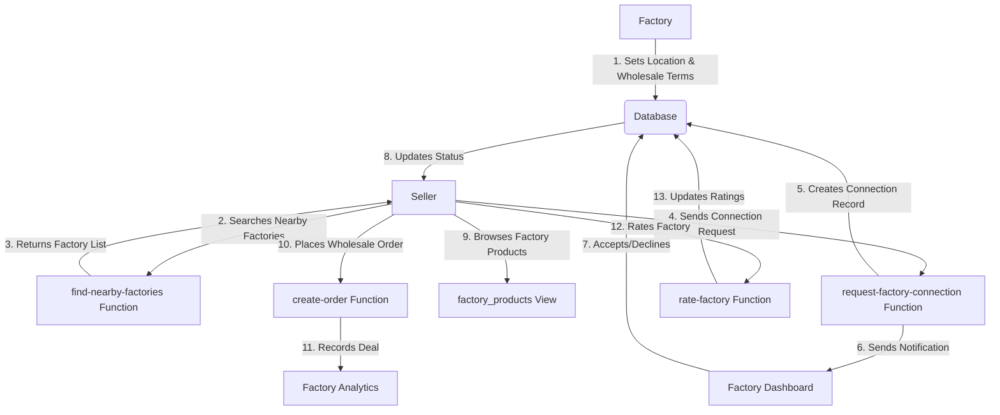

# Aurora Platform: Factory & Seller Features Analysis

**Analysis Date:** April 2026  
**Platform:** Aurora B2B2C E-commerce Marketplace  
**Status:** Production-Ready with Enhancement Opportunities

---

## 📊 Executive Summary

The Aurora platform currently supports a complete **Factory → Seller → Customer** supply chain with:
- ✅ **17 Edge Functions** for backend operations
- ✅ **Complete database schema** with RLS security
- ✅ **Flutter mobile app** with offline-first architecture
- ✅ **Multi-role system** (User, Seller, Factory, Customer)

---

## 🏭 FACTORY FEATURES (Current Implementation)

### 1. Account & Profile Management
| Feature | Status | Description |
|---------|--------|-------------|
| Factory Registration | ✅ Implemented | Special account type with `is_factory` flag |
| Location Settings | ✅ Implemented | GPS coordinates (lat/lng) for discovery |
| License Upload | ✅ Implemented | `factory_license_url` field |
| Verification System | ✅ Implemented | `is_verified` badge with `verified_at` timestamp |
| Profile Fields | ✅ Implemented | Production capacity, specialization, contact info |

### 2. Discovery & Visibility
| Feature | Status | Description |
|---------|--------|-------------|
| Location-Based Discovery | ✅ Implemented | Find factories within 5-200km radius |
| Distance Calculation | ✅ Implemented | Haversine formula in `calculate_distance()` function |
| Search Filters | ✅ Implemented | Radius, verification status, product count |
| Factory Cards | ✅ Implemented | Display stats, ratings, distance |
| Factory Profile Page | ✅ Implemented | Detailed view with all information |

### 3. Connection Management
| Feature | Status | Description |
|---------|--------|-------------|
| Connection Requests | ✅ Implemented | Sellers can send requests via `request-factory-connection` |
| Request Status Tracking | ✅ Implemented | pending/accepted/rejected/blocked |
| Accept/Decline Actions | ⚠️ Partial | Database support exists, UI needs completion |
| Connection List | ⚠️ Partial | Model exists, needs full UI integration |
| Notifications | ✅ Implemented | Auto-notification on new requests |

### 4. Rating & Reviews
| Feature | Status | Description |
|---------|--------|-------------|
| Multi-Dimensional Ratings | ✅ Implemented | Overall, delivery, quality, communication (1-5 stars) |
| Submit Ratings | ✅ Implemented | `rate-factory` edge function |
| Rating Aggregation | ✅ Implemented | `get_factory_rating()` SQL function |
| Review Text | ✅ Implemented | Optional text reviews |
| Rating Display | ⚠️ Partial | Needs UI integration on profile pages |

### 5. Wholesale/B2B Sales
| Feature | Status | Description |
|---------|--------|-------------|
| Wholesale Pricing Engine | ✅ Implemented | Tiered discounts based on quantity |
| Minimum Order Quantity | ✅ Implemented | `min_order_quantity` field |
| Bulk Discounts | ✅ Implemented | `wholesale_discount` percentage |
| Product Catalog | ✅ Implemented | Same as seller products with wholesale flags |
| Price Calculation | ✅ Implemented | Automatic wholesale price calculation |

### 6. Analytics & Insights
| Feature | Status | Description |
|---------|--------|-------------|
| Connection Stats | ⚠️ Partial | Basic tracking exists |
| Rating Analytics | ✅ Implemented | Average ratings, review counts |
| Product Performance | ⚠️ Partial | Via general product analytics |
| Revenue Tracking | ❌ Missing | Factory-specific revenue dashboard needed |

---

## 👤 SELLER FEATURES (Current Implementation)

### 1. Account & Profile Management
| Feature | Status | Description |
|---------|--------|-------------|
| Seller Registration | ✅ Implemented | UUID-based accounts |
| Profile Management | ✅ Implemented | Name, phone, location, currency |
| Store Customization | ✅ Implemented | Store name, description, logo, banner |
| Verification System | ✅ Implemented | `is_verified` status |
| Local Caching | ✅ Implemented | Hive database for offline access |

### 2. Product Management
| Feature | Status | Description |
|---------|--------|-------------|
| Create Products | ✅ Implemented | `create-product` edge function |
| Update Products | ✅ Implemented | `update-product` edge function |
| Delete Products | ✅ Implemented | `delete-product` edge function |
| ASIN Generation | ✅ Implemented | Server-side unique identifiers |
| SKU Generation | ✅ Implemented | Unique stock keeping units |
| QR Code Generation | ✅ Implemented | Full product data in QR codes |
| Image Upload | ✅ Implemented | `upload-image` edge function with resizing |
| Product Categories | ✅ Implemented | Hierarchical category system |
| Inventory Tracking | ✅ Implemented | Stock quantity management |
| Product Sharing | ✅ Implemented | Share via QR/link with full metadata |

### 3. Order Management
| Feature | Status | Description |
|---------|--------|-------------|
| Create Orders | ✅ Implemented | `create-order` edge function |
| Order Status Tracking | ✅ Implemented | pending/confirmed/shipped/delivered/cancelled |
| Stock Validation | ✅ Implemented | Prevent overselling |
| Payment Methods | ✅ Implemented | Multiple cards, secure storage |
| Order History | ✅ Implemented | View past orders |
| Invoice Generation | ❌ Missing | PDF invoice generation needed |

### 4. Customer Management
| Feature | Status | Description |
|---------|--------|-------------|
| Customer Profiles | ✅ Implemented | Contact info, purchase history |
| Sales Recording | ✅ Implemented | Record cash/card sales |
| Customer Analytics | ✅ Implemented | Top customers, purchase frequency |
| Customer Segmentation | ❌ Missing | VIP, regular, new customer tags |

### 5. Factory Connections (As Buyer)
| Feature | Status | Description |
|---------|--------|-------------|
| Find Nearby Factories | ✅ Implemented | `find-nearby-factories` edge function |
| Send Connection Requests | ✅ Implemented | Request connection with factories |
| View Connection Status | ⚠️ Partial | Basic status tracking |
| Rate Factories | ✅ Implemented | Multi-dimensional rating system |
| Browse Factory Products | ⚠️ Partial | Via `factory_products` view |

### 6. Website Dashboard
| Feature | Status | Description |
|---------|--------|-------------|
| Publish/Unpublish Site | ✅ Implemented | Toggle site visibility |
| Catalog Management | ✅ Implemented | Select products for website |
| Visitor Analytics | ⚠️ Partial | Mock data, needs real implementation |
| Conversion Tracking | ⚠️ Partial | Mock data, needs real implementation |
| Revenue Analytics | ⚠️ Partial | Mock data, needs real implementation |
| Top Products | ⚠️ Partial | Mock data, needs real implementation |
| Template Selection | ❌ Missing | UI placeholder only |
| Custom Domain | ❌ Missing | Not implemented |

### 7. Sales Analytics
| Feature | Status | Description |
|---------|--------|-------------|
| Real-time KPIs | ⚠️ Partial | Basic metrics available |
| Sales Trends | ⚠️ Partial | Chart visualization exists |
| Top Products | ✅ Implemented | Product performance ranking |
| Top Customers | ✅ Implemented | Customer value ranking |
| Revenue Reports | ❌ Missing | Comprehensive financial reports needed |
| Export Reports | ❌ Missing | CSV/PDF export functionality |

### 8. Chat & Communication
| Feature | Status | Description |
|---------|--------|-------------|
| Real-time Messaging | ✅ Implemented | Supabase realtime channels |
| Deal Negotiation Chat | ✅ Implemented | Chat tied to deals |
| Nearby User Discovery | ✅ Implemented | Location-based chat |
| Message History | ✅ Implemented | Persistent conversation storage |
| File Sharing | ❌ Missing | Image/document sharing in chat |

---

## 🔄 INTEGRATION FLOW: Factory ↔ Seller

### Current Integration Points



### Data Flow Analysis

#### 1. Factory Onboarding Flow
```
Factory Signup → Set Location → Upload License → Configure Wholesale Terms → Go Live
```
**Tables Used:** `sellers`, `auth.users`  
**Edge Functions:** `process-signup`  
**Status:** ✅ Complete

#### 2. Factory Discovery Flow
```
Seller Opens App → Grant Location Permission → Set Search Radius → Query Nearby → View Results
```
**Tables Used:** `sellers`, `products`  
**Functions:** `find_nearby_factories()`, `calculate_distance()`  
**Edge Functions:** `find-nearby-factories`  
**Status:** ✅ Complete

#### 3. Connection Request Flow
```
Seller Views Factory → Click Connect → Add Notes → Send Request → Factory Notified → Factory Responds → Status Updated
```
**Tables Used:** `factory_connections`, `notifications`  
**Edge Functions:** `request-factory-connection`  
**Status:** ⚠️ Partial (UI needs completion)

#### 4. Wholesale Purchase Flow
```
Seller Browses Factory Products → Select Items → Apply Tier Discounts → Create Order → Validate Stock → Process Payment → Record Deal → Update Analytics
```
**Tables Used:** `products`, `orders`, `order_items`, `factory_connections`  
**Edge Functions:** `create-order`  
**Services:** `WholesalePricingEngine`  
**Status:** ⚠️ Partial (integration gaps)

#### 5. Rating & Feedback Flow
```
Order Delivered → Seller Opens Rating UI → Rate Delivery/Quality/Communication → Add Review → Submit → Aggregate Ratings → Update Factory Profile
```
**Tables Used:** `factory_ratings`, `sellers`  
**Edge Functions:** `rate-factory`  
**Functions:** `get_factory_rating()`  
**Status:** ⚠️ Partial (UI needs integration)

---

## 🚨 IDENTIFIED GAPS & RECOMMENDATIONS

### Critical Gaps (High Priority)

#### 1. Factory Revenue Dashboard
**Gap:** Factories cannot track revenue from seller relationships  
**Recommendation:**
- Create `factory_revenue` view aggregating order totals
- Build dashboard showing: total revenue, avg deal size, top sellers
- Add monthly/yearly comparison charts

#### 2. Connection Request Management UI
**Gap:** No complete UI for factories to accept/decline requests  
**Recommendation:**
- Complete `factory_connections_page.dart` with action buttons
- Add bulk actions (accept all, decline all)
- Implement notification preferences

#### 3. Invoice Generation
**Gap:** No automated invoice creation for wholesale orders  
**Recommendation:**
- Add `generate-invoice` edge function
- Create PDF template with company branding
- Support email delivery

#### 4. Real Analytics Integration
**Gap:** Website dashboard uses mock data  
**Recommendation:**
- Create `analytics_snapshots` table
- Implement real-time queries for visitors, conversions
- Add conversion funnel tracking

### Medium Priority Enhancements

#### 5. Advanced Search & Filtering
**Current:** Basic radius search  
**Enhancement:**
- Filter by specialization/category
- Filter by minimum order quantity
- Filter by verification status
- Sort by rating, distance, product count

#### 6. Deal Negotiation Workflow
**Current:** Simple chat  
**Enhancement:**
- Create formal deal proposals
- Counter-offer system
- Accept/reject with terms
- Auto-generate contracts

#### 7. Inventory Sync for Wholesale
**Current:** Manual stock updates  
**Enhancement:**
- Auto-deduct from factory inventory on order
- Low stock alerts for sellers
- Backorder management

#### 8. Customer Segmentation
**Current:** Flat customer list  
**Enhancement:**
- VIP/Regular/New tags
- Purchase frequency scoring
- Lifetime value calculation
- Targeted promotions

### Low Priority (Nice to Have)

#### 9. Multi-Language Support
**Current:** Arabic localization exists  
**Enhancement:** Expand to English, French for international trade

#### 10. API for Third-Party Integration
**Enhancement:** REST API for ERP/accounting software integration

#### 11. Mobile App for Factories Only
**Enhancement:** Dedicated factory management app

#### 12. Predictive Analytics
**Enhancement:** ML-based demand forecasting

---

## 📋 RECOMMENDED NEW FEATURES

### For Factories

| Feature | Priority | Effort | Impact |
|---------|----------|--------|--------|
| Revenue Dashboard | 🔴 High | Medium | High |
| Bulk Order Management | 🔴 High | High | High |
| Production Queue Tracking | 🟡 Medium | High | Medium |
| Raw Materials Inventory | 🟡 Medium | Medium | Medium |
| Quality Control Logs | 🟡 Medium | Low | Medium |
| Shipping Integration | 🟡 Medium | High | High |
| Automated Invoicing | 🔴 High | Medium | High |
| Seller Performance Ratings | 🟢 Low | Low | Low |

### For Sellers

| Feature | Priority | Effort | Impact |
|---------|----------|--------|--------|
| Purchase Order Automation | 🔴 High | Medium | High |
| Supplier Comparison Tool | 🔴 High | Medium | High |
| Price History Tracking | 🟡 Medium | Low | Medium |
| Reorder Alerts | 🟡 Medium | Low | High |
| Multi-Supplier Sourcing | 🟡 Medium | High | Medium |
| Landing Cost Calculator | 🟡 Medium | Medium | High |
| Profit Margin Analyzer | 🟡 Medium | Low | High |
| Tax Compliance Reports | 🟢 Low | High | Medium |

### For Both (Integration)

| Feature | Priority | Effort | Impact |
|---------|----------|--------|--------|
| Contract Management | 🔴 High | High | High |
| Escrow Payment System | 🔴 High | High | High |
| Dispute Resolution System | 🟡 Medium | High | High |
| Shared Calendar/Scheduling | 🟢 Low | Medium | Low |
| Video Call Integration | 🟢 Low | Medium | Medium |
| Document Sharing | 🟡 Medium | Medium | High |
| Shipment Tracking | 🟡 Medium | High | High |

---

## 🛠 TECHNICAL DEBT & IMPROVEMENTS

### Code Quality Issues

1. **Unused Code:** 15+ unused methods/variables identified
2. **Deprecated APIs:** 100+ `withOpacity()` calls need migration
3. **Type Safety:** Multiple unnecessary type checks
4. **Async/Context:** BuildContext safety issues after async gaps

### Architecture Improvements

1. **State Management:** Consider migrating to Riverpod for better testability
2. **Error Handling:** Centralize error handling across edge functions
3. **Logging:** Add structured logging for debugging
4. **Testing:** Increase test coverage (currently <30%)

### Performance Optimizations

1. **Image Caching:** Already implemented, but can add progressive loading
2. **Database Indexes:** Add composite indexes for common queries
3. **Query Optimization:** Use materialized views for analytics
4. **Pagination:** Implement cursor-based pagination for large lists

---

## 🎯 ROADMAP RECOMMENDATIONS

### Phase 1: Complete Core Features (Q2 2026)
- [ ] Complete connection request UI
- [ ] Implement factory revenue dashboard
- [ ] Add invoice generation
- [ ] Fix critical code quality issues

### Phase 2: Enhanced Integration (Q3 2026)
- [ ] Build deal negotiation workflow
- [ ] Implement contract management
- [ ] Add escrow payment system
- [ ] Real analytics integration

### Phase 3: Advanced Features (Q4 2026)
- [ ] Predictive analytics
- [ ] Mobile app for factories
- [ ] Third-party API
- [ ] Multi-language expansion

---

## 📊 COMPARISON MATRIX

| Feature Category | Factory | Seller | Integration |
|-----------------|---------|--------|-------------|
| Account Setup | ✅ Complete | ✅ Complete | ✅ Complete |
| Profile Management | ✅ Complete | ✅ Complete | ✅ Complete |
| Discovery/Search | ✅ Complete | ✅ Complete | ✅ Complete |
| Product Management | ✅ Complete | ✅ Complete | ✅ Complete |
| Order Processing | ⚠️ Partial | ✅ Complete | ⚠️ Partial |
| Payments | ❌ Missing | ✅ Complete | ❌ Missing |
| Analytics | ⚠️ Partial | ⚠️ Partial | ❌ Missing |
| Communication | ❌ Missing | ✅ Complete | ⚠️ Partial |
| Ratings/Reviews | ✅ Complete | ✅ Complete | ✅ Complete |
| Reporting | ❌ Missing | ⚠️ Partial | ❌ Missing |

**Legend:** ✅ Complete | ⚠️ Partial | ❌ Missing

---

## 📝 CONCLUSION

The Aurora platform has a **solid foundation** for B2B2C e-commerce with:
- ✅ Robust database schema with proper security
- ✅ Essential edge functions deployed
- ✅ Multi-role architecture working
- ✅ Offline-first mobile app

**Key Strengths:**
1. Factory discovery system is production-ready
2. Wholesale pricing engine is sophisticated
3. Rating system is comprehensive
4. Security (RLS) properly implemented

**Priority Actions:**
1. Complete UI integration for connection management
2. Build factory revenue analytics
3. Implement invoice generation
4. Fix technical debt (deprecated APIs, unused code)
5. Add real analytics data to dashboards

**Estimated Completion:** With focused development, all critical gaps can be addressed in **8-12 weeks**.

---

**Document Version:** 1.0  
**Last Updated:** April 2026  
**Author:** AI Code Analysis System
